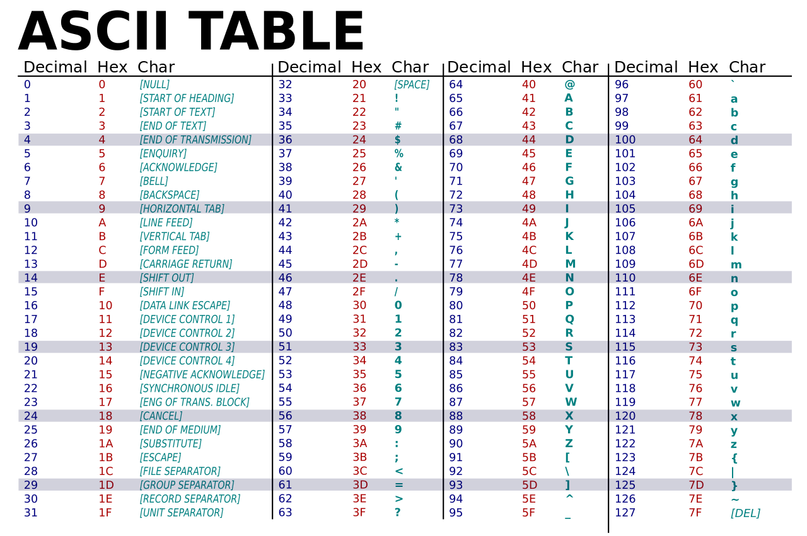

# Programación de Sistemas Embebidos - Repaso de lenguaje C - LAB 0
### **Alumno:       Valenzuela Alejo**
### **Laboratorio:  0**
###  **Asignatura:   Sistemas Embebidos**
=====================================================================================================================


### Bibliografia: 

Brian Kernighan y Dennis Ritchie, El lenguaje de programación C (título original en inglés: The C Programming Language)

[Eduardo Grosclaude, Taller de Lenguaje en C](http://se.fi.uncoma.edu.ar/pse2020/taller-c/index.html)

=====================================================================================================================

## 0. Escriba un programa hello world. Compilar y ejecutar.

Por ejemplo: 

	vi hello.c   # edicion. Usar vi u otro editor preferido
	make hello   # compilacion
	./hello	     # ejecucion

### Respuesta

```c
#include <stdio.h>
int main()
{
    printf("Hola Mundo");
    return 0;
}
```

## 1. Enumerar los tipos de datos básicos en C. 
   Escriba una definición de una variable por cada tipo. Por ej.  :  int a;

### Respuesta

[Tipos de datos en C](https://www.geeksforgeeks.org/data-types-in-c/)

Existen 3 tipos de datos en C:
- Primitive Data Types: 

        Los tipos de datos primitivos son los tipos de datos más básicos que se utilizan para representar valores simples como números enteros, flotantes, caracteres, etc.
        Varios de ellos permiten trabajar con presicion simple o doble. En ellos. hablar de presicion significa que la cantidad total de bytes se divide en tres campos principales: el bit de signo, el exponente y la mantisa.

```c
    int a;       //4 bytes (shor int 2, long int 4, long long int 8). Representa valores de -2,147,483,648 a 2,147,483,647 o en la version sin signo valores de 0 a 4,294,967,295 (%d).
    char a;     //1 byte. Representa valores de 0 a 255 o en su version sin signo de -128 a 127 (%c)
    float a;   //4 bytes, representa numeros con coma con presicion simple, sus valores van de 1.2E-38 a 3.4E+38 (%f).
    double a;   //8 bytes, representa números de coma flotante de doble precisión sus valores van de 1.7E-308 a 1.7E+308 (%lf). El long utiliza 16 bytes (%Lf)
    void* a;      //El tipo de datos nulo en C se utiliza para especificar que no hay ningún valor presente. No proporciona un valor de resultado a quien lo llama. No tiene valores ni operaciones. Se utiliza para representar nada. Void se usa de múltiples maneras como tipo de retorno de función, argumentos de función como nulo y punteros a nulo.
```
Asimismo hay otros tipos de datos que se pueden definir, ellos son:

- User Defined Data Types:

        Los tipos de datos "User Defined" los define el propio usuario.


- Derived Types:

        Los tipos de datos que se derivan de los tipos de datos primitivos o integrados se denominan tipos de datos derivados.

La siguiente imagen presenta un resumen de los tipos de datos en C:


## 2. Explique qué significa la palabra word cuando el contexto es la Arquitectura de una Computadora.


En la arquitectura de computadoras, las longitud de palabra o "word" se define como la cantidad de bits que el procesador puede procesar a la vez (es deccir, manipular en una sola operacion).

Normalmente esta definida por el tamanio de los registros, pero esto puede variar si se trabaja con micros cuyas arquitecturas permitan ejecutar funciones de DSP.
La longitud de palabra determina varios aspectos del sistema, como el tamaño de los registros de la CPU, el ancho del bus de datos y la cantidad de memoria que el procesador puede direccionar directamente.


## 3. ¿Cuántos bits puede almacenar una variable declarada como int (ej. int var;) en 3 computadoras de arquitecturas diferentes: arquitecturas de 8bits, 32bits y 64bits?.

    NOTA: la respuesta no es tan trivial como parece. Deberá buscar información
          sobre el lenguaje de programación C. Use wikipedia u otros recursos.

[Representacion en memoria](https://www.geeksforgeeks.org/representation-of-int-variable-in-memory-in-cpp/)

- Arquitectura de 8 bits:

En una arquitectura de 8 bits, un int generalmente tiene un tamaño de 8 bits. Sin embargo, dado que un int debe tener al menos 16 bits según el estándar C, el compilador en una arquitectura de 8 bits probablemente lo implementará como un short int, que normalmente tiene un tamaño de 16 bits en la mayoría de las implementaciones de C.

- Arquitectura de 32 bits:

En una arquitectura de 32 bits, un int suele tener un tamaño de 32 bits, lo que significa que puede almacenar valores enteros en el rango de -2,147,483,648 a 2,147,483,647.

- Arquitectura de 64 bits:

En una arquitectura de 64 bits, un int generalmente sigue teniendo un tamaño de 32 bits, al menos en muchas implementaciones de compiladores C. Esto se debe a que mantener el tamaño de int en 32 bits permite la compatibilidad con código C existente y con estándares establecidos. Sin embargo, en algunas implementaciones de C, un int podría ser ampliado a 64 bits en una arquitectura de 64 bits para aprovechar el aumento en el tamaño de palabra.


## 4. Explique la difercia en la salida de las siguientes instrucciones:

```c
   char a = 'M';
   printf ("a = %i \n", a);
   printf ("La letra %c \n", a);
```
   ¿Cuál es el valor numérico de a?

### Respuesta:

El carácter 'M' tiene un valor numérico según la tabla ASCII. En la segunda linea vemos que se pide un valor entero `%i` por lo que se imprimirá su valor numérico `77`. Luego se pide el caracter `%c`, por lo que se imprimira `M`




## 5. ¿Cuál es el rango numérico de i y j?

```c
   char i;
   unsigned char j;
```
### Respuesta:

El rango numerico de un `char` es de -127 a 128.
El rango numerico de un `unsigned char` es de 0 a 255.

## 6. ¿Cuál es el valor en base 2 (binario) de i, j, k, m, n, p ?
```c
   char i = 'a';
   char j = 77;
   char k = 0x4D;
   unsigned char m = 'a';
   unsigned char n = 0x4d;
   unsigned char p = 'A';
```
   Explique el por qué de su repuesta. 
   Contestar: Las variables anteriores, ¿fueron declaradas e inicializadas con valores diferente?

### Respuesta:

!TODO: Preguntar

- i: El caracter `a` en la tabla ASCII representa el valor decimal 97, que en binario es `01100001`.
- j: El valor decimal de 77 es `01001101` en binario (se asume una codificación de 8 bits).
- k: El valor hexadecimal 0x4D es `01001101` en binario.
- m: El caracter `a` en la tabla ASCII representa el valor decimal 97, que en binario es `01100001`.
- n: El valor hexadecimal 0x4d es `01001101` en binario.
- p: El caracteri `A` en la tabla ASCII representa el valor decimal 65, que en binario es `01000001`.


## 7. Arreglos, Punteros y Operaciones
-----------------------------------

    Comprender las siguientes definiciones y operaciones

```c
#include <stdio.h>

int main () {

	int x[3];
	int *ptr;

	char a;
	char *b;

    x[0] = 1024;
    x[1] = 32;
    x[2] = -1;
	ptr = &x[0];
	ptr++;
	ptr++;

	a = 5;
	b = &a;
	printf ("a=%i, lo apuntado por b=%i, el contenido de b=%X, y la direccion de b=%X \n", a, *b, b, &b);
	
	*b = 21;
}
```

### Respuesta:

1. Si al comenzar el programa el sistema asignó la dirección 0xFFA00004 al arreglo x[], ¿Cuál es el valor final del contenido de ptr al finalizar la ejecución del programa?

    La linea `&x[0]` Obtiene la dirección de memoria del primer elemento del array `x[]` y se lo asigna a ptr, luego ptr aumenta 2 veces en 1, por lo cual, el valor final de ptr sera la direccion de memoria 0xFFA00006

2. ¿Cuál es el valor final del contenido de la variable 'a' al finalizar el programa? 

    El valor final de a es 5.

3. ¿Cuál es la dirección de la variable x[2]?

    La direccion de la variable x[2] sera `0xFFA00004`


## 7.2 Arreglos y punteros: Comprender el siguiente código.
```c
    unsigned int array[5];
    array[2] = 99;

    unsigned int *pointer;
    pointer = &array[0];
    *(pointer+2) = 99;

    pointer = array;
```

## 8 .Operaciones sobre bits particulares
--------------------------------------

    En la programación de sistemas embebidos es muy común leer y escribir
    registros del hardware. En particular, se requiere poder modificar 
    ciertos bits y otros no. O conocer el valor de un bit particular.

## 8.1 Comprender una operación shift. Por ejemplo: (1 << 5)
    Escriba un programa que defina una variable de tipo char.
    Asigne la operacion shift mencionada arriba a esa variable.
    Indique cual es el valor en base 2 de la variable de tipo char.
    Indique cual es el valor en decimal.

```c
    char a = 0b00000001;
    char b;
    b = a << 5; //-> 0b00010000
    printf("a: %i\n",a);
    printf("b: %i",b);
```

## 8.2 Comprender una operación shift que luego se niega. Por ejemplo: ~(1 << 5)
    Escriba un programa que defina una variable de tipo char.
    Asigne a la variable la operacion shift mencionada arriba.
    Indique cual es el valor en base 2 de la variable de tipo char.
    Indique cual es el valor en decimal.

```c
    char a = 0b00000001; 
    char b; 
    b = ~(a << 5); //-> 0b11011111
    printf("a: %i\n",a);
    printf("b: %i",b);
```

## 8.3 Comprender los operadores AND y OR (& y |)
```c
    #define BIT3 3
    unsigned char status;

    status = 0b00110101;
    status = status | 0xFA;
    status = status & 20;
    status |= (1 << 6);
    status &= ~(1 << BIT3)
    status |= (1 << BIT3)
```
    - Poder verificar el estado de un bit.
    - Poder obtener sólo una parte de los bits. Por ejemplo: & 0xF0

## 8.4 Para la siguiente definición:
```c
    unsigned char x = 11;
```
    Indique el valor binario de cada bit de la variable x
    (bit7 bit6 bit5 bit4 bit3 bit2 bit1 bit0)

### Respuesta 

```c
    #include <stdio.h>

    int main() {
        unsigned char x = 11;
        for (int i = 7; i >= 0; i--) {
            // Utilizamos el operador shift de corrimiento a la derecha (>>) para desplazar el bit i a la posición de bit menos significativo
            // Luego, utilizarmos el operador de AND (&) con 1 para obtener el valor del bit i
            unsigned char bit = (x >> i) & 1;
            printf("%d", bit);
        }
        printf("\n");
        return 0;
    }
```
El valor final obtenido es: `00001011`

## 8.5 Se desea ejecutar un bloque de código en C si el bit 3 de la variable x anterior está en 1. Complete la siguiente sentencia condicional if

    if (  COMPLETAR  ) printf ("el bit3 de la variable registro es 1 \n");

### Respuesta: 

```c
    if (x<<4 == 1) printf ("el bit3 de la variable registro es 1 \n");
```

## 8.6 Escriba una sentencia en C para eliminar los bits2, bit1 y bit0 (ponerlos en cero), sin modificar el resto de los bits.

### Respuesta:

```c
    x &= 0b11111000;
```

## 8.7 Escriba una sentencia en C para poner asertar los bits7 y bit6 (ponerlos en uno), sin modificar el resto de los bits.

### Respuesta:

```c
    x |= 0b11000000;
```

## 9. Registros de 8 bits, aritmetica de 16 a 32 bits
--------------------------------------------------

    En ocasiones queremos realizar un cómputo, cuyo resultado debe ser almacenado en un registro de 8 bits.

    ¿Qué sucede con el resultado de la siguiente operación?
```c
    unsigned char RES;
    unsigned char var;
    var = 190;
    RES = (unsigned char)(var * 500) /190;
```

### Respuesta:

- RES es un unsigned char, por lo que su rango es de 0 a 255.
- var es un unsigned char, por lo que su rango es de 0 a 255.
- 500 es un int.

El resultado final se almacena en RES, que es un unsigned char. Por ello el valor calculado excede el rango de un unsigned char (0 a 255), y ocurrirá un desbordamiento del buffer.

## 10. Desarrollar el programa que se detalle en archivo aparte.
